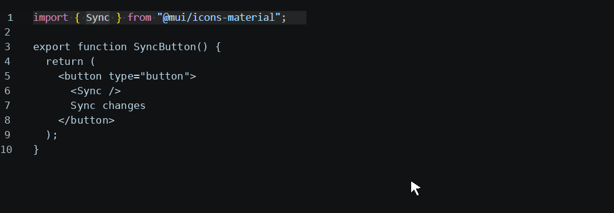

# MUI Icon Preview

Preview icons from `@mui/icons-material` without leaving VS Code. The extension reads icon sources from the current workspace, so hover previews and icon search work completely offline.

[](LICENSE)

### Hover preview



## Features

- Hover an imported MUI icon to see its module and a 64 by 64 SVG preview alongside VS Code's standard TypeScript information.
- Complete icon component names in TypeScript, TSX, JavaScript, and JSX files. The focused completion renders an SVG in the suggestion details panel.
- Run **MUI Icons: Search** from the Command Palette to search installed icons and insert both the import and component usage.
- Index icon names on first use and cache names, package locations, and SVG previews to avoid repeated filesystem reads.

## Usage

Install `@mui/icons-material` in the project you want to inspect, then import an icon normally:

```tsx
import HomeIcon from '@mui/icons-material/Home';

export function HomeLink() {
	return <HomeIcon />;
}
```

Hover `HomeIcon` to see a compact 64 by 64 preview, its import source, a link to the matching MUI documentation search, and the standard TypeScript hover information.

Run **MUI Icons: Search** from the Command Palette to search the locally installed icon catalog. Selecting an icon inserts its import and JSX component usage.

## Completion previews

Type a prefix such as `<Home` in a supported file, then focus a MUI icon completion. Completion rows identify matching entries as “MUI Icon” and the suggestion details panel shows the local SVG preview plus the import path.

If the details panel is collapsed, use VS Code's **Toggle Suggestion Details** command to show it.

VS Code extensions cannot place arbitrary images directly in completion rows. `CompletionItemLabel` is text-only, and `CompletionItemKind` displays only built-in theme icons.

MUI Icon Preview uses `CompletionItem.documentation` for previews and loads that documentation in `resolveCompletionItem`, so SVG work happens only for the focused suggestion. SVG data URIs are generated locally from the installed workspace package, cached, and if loading fails the completion remains usable without documentation.

## Requirements

The opened project must have `@mui/icons-material` installed. No network access is used by the extension.

MUI Icon Preview requires VS Code 1.85 or newer and a file-system-backed workspace. Local, SSH, WSL, and Dev Container workspaces are supported when `@mui/icons-material` is installed in that workspace.

Supported editor languages:

- TypeScript
- TypeScript React
- JavaScript
- JavaScript React

## Privacy

Icon source files are read from the active workspace and converted to SVG previews locally. Workspace content is not uploaded or sent to an external service. See [SECURITY.md](SECURITY.md) for reporting and security details.

## Issues and Support

Report bugs and feature requests through [GitHub Issues](https://github.com/IgorBezanovic/mui-icon-preview/issues). Do not use public issues for security reports.

## Disclaimer

MUI Icon Preview is an independent community extension and is not affiliated with or endorsed by MUI or Google. MUI and Material Design are trademarks of their respective owners. The Marketplace package-and-preview artwork is original to this project.

The editable artwork source is available at [images/icon.svg](images/icon.svg); the Marketplace uses the generated `images/icon.png` asset.

## Development

1. Run `npm install`.
2. Run `npm run compile`.
3. Press `F5` in VS Code to launch the Extension Development Host.
4. Open a React project that contains `@mui/icons-material`.
5. Hover a symbol imported from a direct icon module, such as `import HomeIcon from '@mui/icons-material/Home';`.

Build a production bundle with `npm run package`.

Create a Marketplace package with `npm run vsce:package`.

## Publishing

Build a VSIX with `npm run vsce:package`, then upload it through the [Visual Studio Marketplace publisher portal](https://marketplace.visualstudio.com/manage). Releases are published manually.

See [PUBLISHING.md](PUBLISHING.md) for first-release and update instructions.

## License

Released under the [MIT License](LICENSE).
